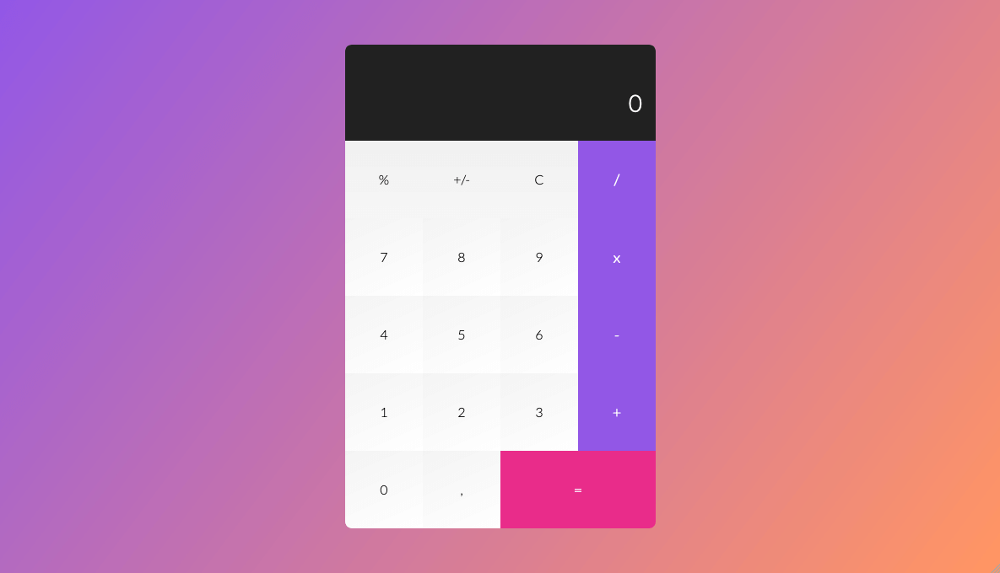

# Calculator project

The project is a Calculator app. It is based on a [free psd concept](https://creativetacos.com/free-calculator-psd/). The goal was to code it with any technology. It should be responsive without the use of any graphics as well as it should have hover effects.
I have decided to code the app with the use of html, scss, vanilla javascript. To bundle the project I decided to use the [parcel bundler](parceljs.org) as it is easy to use and hassle-free.

If you want to see the final effect, go and click the link below.
If you want, you can get the application repo and play around.
More details in the 'how to use' section below.

## Website 🚀

[go to the website](https://rogreyroom.github.io/calc)

## How to use

- clone the repo
- go to the repo folder on your computer
- run `yarn` or `npm install`
- run `yarn dev` or `npm run dev` to run the app in developer mode
- go to `http://localhost:1234` to see the result

If you want to build it

- run `yarn build` or `npm run build`
- add the content of the docs folder to your server public folder.
- go to your domain Http address

## Version

v.1.0.0

## Author

Robert Adamczewski

## License

This project is licensed under MIT License - see the [LICENSE.md](./LICENSE.md) file for details.
